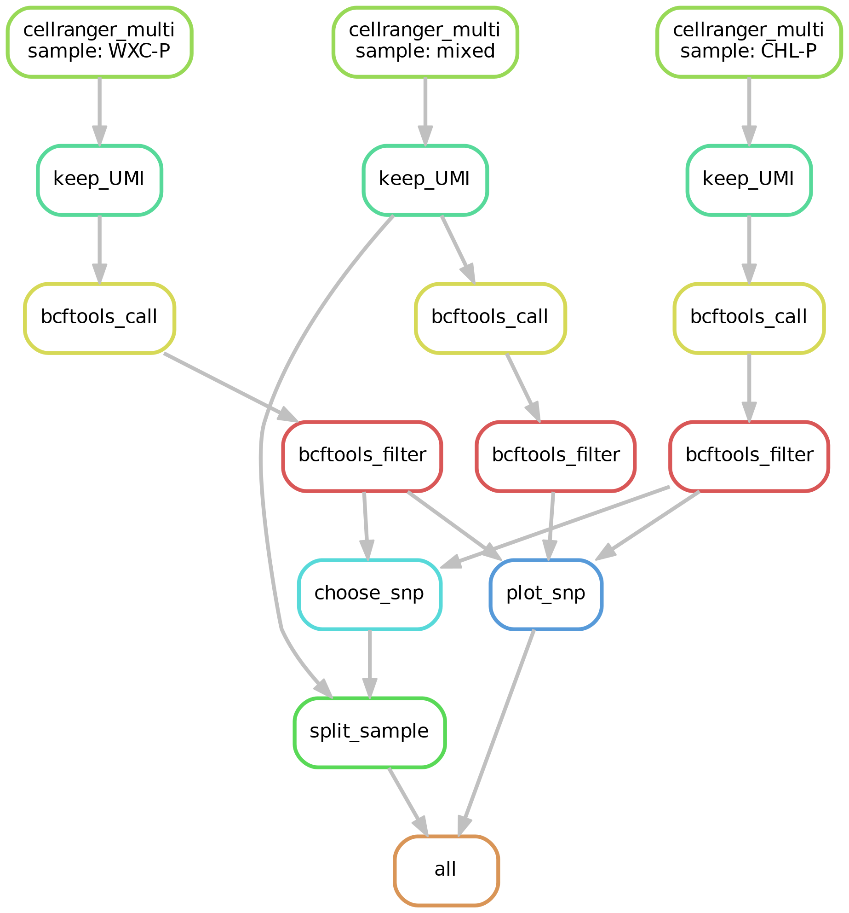

# MixSplit

从混合细胞文库中根据个体单核苷酸变异位点将细胞进行分类。

### 安装

**注意：建议根据个人环境更改软件版本。**

- 操作系统：Linux
- 处理器：8核处理器（推荐16核）
- 内存：64GB RAM（推荐128G）
- 存储空间：根据测序数据大小建议至少200G以上空间

### 配置

建议在 `config.xml` 中使用绝对路径来设置软件路径。
由于不同的操作系统和运行环境可能有不同的当前工作目录，使用绝对路径可以确保您的配置在任何情况下都能正确引用所需的文件和目录。
在 `config.yaml` 中，找到与软件路径相关的配置项，并将路径修改为绝对路径。
请注意，在将路径更改为绝对路径时，确保路径是有效的，并且对于您的系统和环境来说是可访问的。这样做可以避免由于相对路径造成的问题，并提高配置的可靠性和稳定性。

- cellranger=7.0.1

- snakemake=7.25.0

- python=3.10.6
  
  - pysam=0.20.0
  
  - scipy=1.10.1
  
  - pandas=2.0.2
  
  - matplotlib=3.7.1
  
  - pip=22.3.1
    
    - matplotlib-venn=0.11.9

- samtools=1.16.1

- sambamba=1.0

- bcftools=1.16

### 使用方法

1. 在workflow的目录在创建配置文件，配置文件名为`{sample1}.csv`，`{sample2}.csv`和`mixed.csv`，您可以参考 `example` 目录中的示例配置文件来创建这些文件。
   修改Snakemake文件中的SAMPLES变量，与sample1和sample2对应。
2. 打开 `Snakemake` 文件，并找到 `SAMPLES` 变量。将其与 `sample1` 和 `sample2` 相应地对应起来。确保 `SAMPLES` 变量包含了您要处理的所有样本的名称。
3. 要提交任务，使用以下命令：
   `snakemake --cluster "qsub -cwd -pe smp {threads}" --jobs 10`
    或者，如果要在本地运行，使用以下命令：
   `snakemake --cores 20`
    注意：根据您的任务队列和资源配置，可能需要调整 `--cluster` 参数中的 `qsub` 命令和选项来正确地提交作业。
4. Snakemake 将根据您的配置文件和样本信息开始运行 `cellranger multi` 来处理数据。任务将根据您的配置在集群上运行（如果使用了 `--cluster` 参数）或在本地运行（如果使用了 `--cores` 参数）。

请确保您在运行 Snakemake 命令之前已经正确安装了 `cellranger` 和 `Snakemake`，并且您已经设置好了集群的调度器和资源。根据您的实际环境，可能需要调整 `cellranger` 的路径和 `config.yaml` 文件中的其他相关路径。

### 结果

- cellranger：使用cellranger 对原始样本进行处理，生成了多个结果文件，包括：
  - web_summary.html：Web可视化汇总报告，提供了关于样本处理和测序质量的信息。
  - 基因表达矩阵：包含对每个细胞的基因表达值的测量结果。
  - 比对 BAM 文件：包含每个细胞的测序数据比对到参考基因组后的结果。
- vcf：使用 bcftools 对样本进行变异调用，生成了变异调用格式（VCF）文件，并对其进行了过滤，得到单核苷酸变异（SNP）文件。
- sample_vcf：对每个样本生成了样本特异的 SNP 文件，该文件包含样本个体的单核苷酸变异信息。
- splited_matrix：对混合样本的 mixer 文库进行拆分，得到了各个样本的文件，
  - barcode.txt: 对每个细胞进行分类为 sample1 和 sample2 的 reads 数量统计，并进行了卡方检验以判断细胞是否能被准确分类。该文件包含卡方检验的统计值和 p 值。
  - 基因表达矩阵：混合样本能被分类为 sample1 和 sample2 的表达矩阵。

### 常见问题解答

Q:    cellranger multi最后运行完成后有一步mv操作报错，怎么解决？

A:    在 cellranger multi 运行完成后，如果出现 mv 操作报错，可以尝试执行以下解决方案：手动执行 mv 操作，进入 workflow 目录，将 sample 文件夹手动移动到 cellranger 文件夹中。您可以使用以下命令：

`mv workflow/sample workflow/cellranger`

### 支持与反馈

如果在使用过程中遇到问题或是对软件有任何建议或改进意见，欢迎提出issue。可以通过发送电子邮件至 enzeas@gmail 与我取得联系，我会尽快回复您并提供所需的支持。
